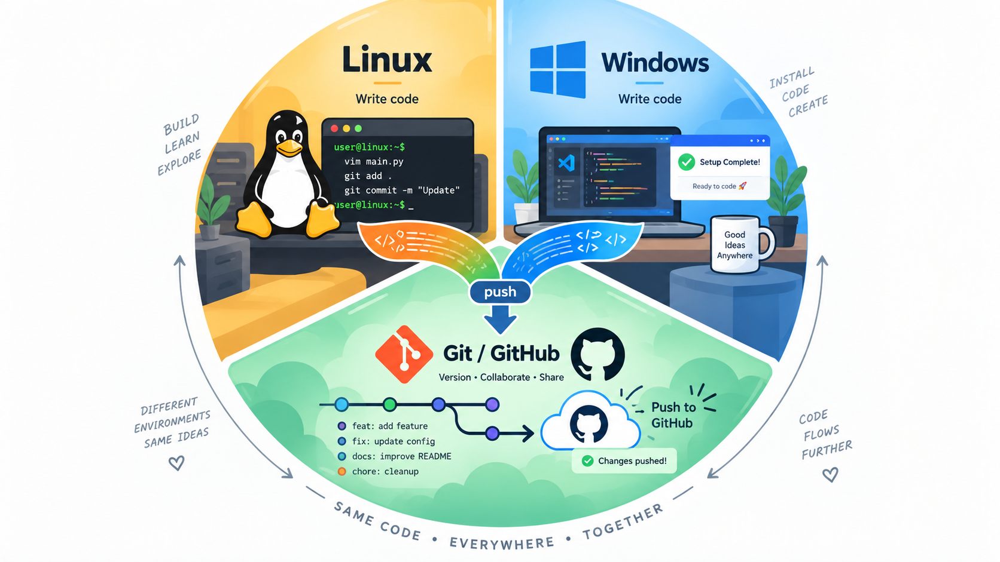

# Installationslabb
denna repository innehåller dokumentation för en installation av Linux, Windows och hur jag kopplar det till Git.

## Innehåll
- Linux-installation
- Windows-installation
- Git och GitHub
- Felsökning
- Reflektion

## Dokumentation 

[Läs labbdokumentationen här](labb_dokumentation.md)

