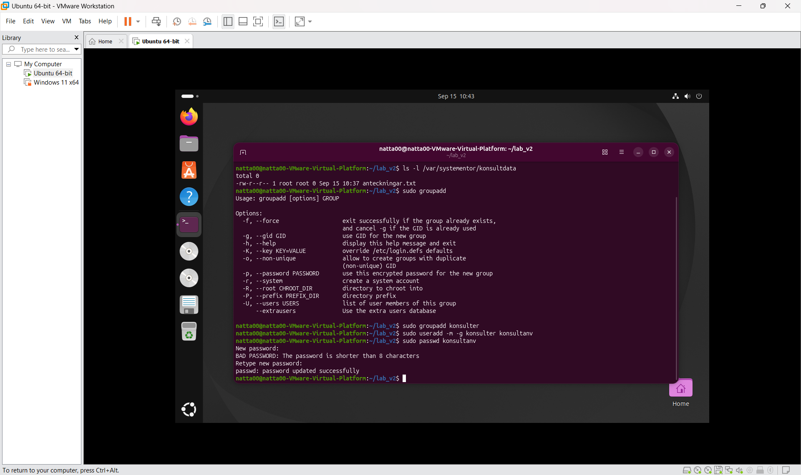
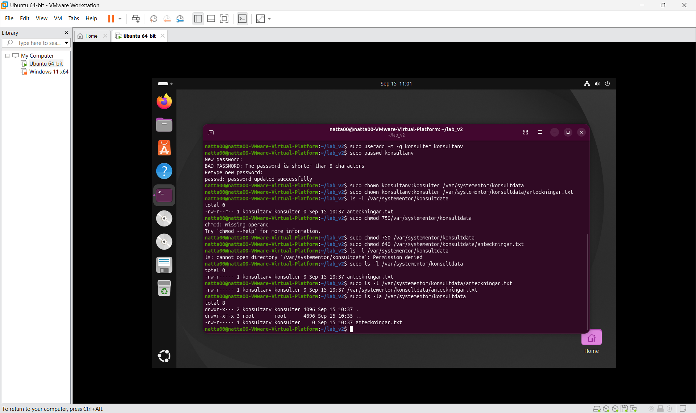
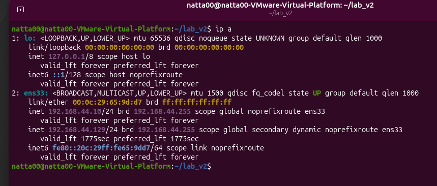
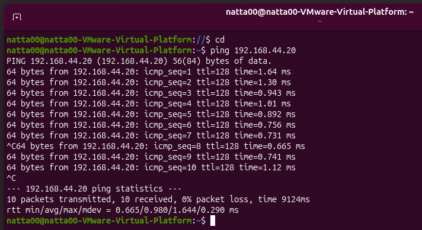
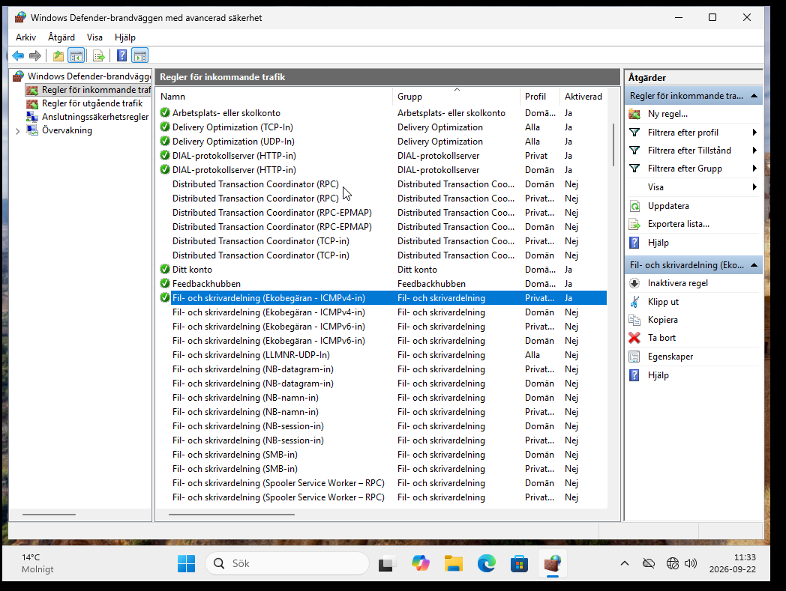
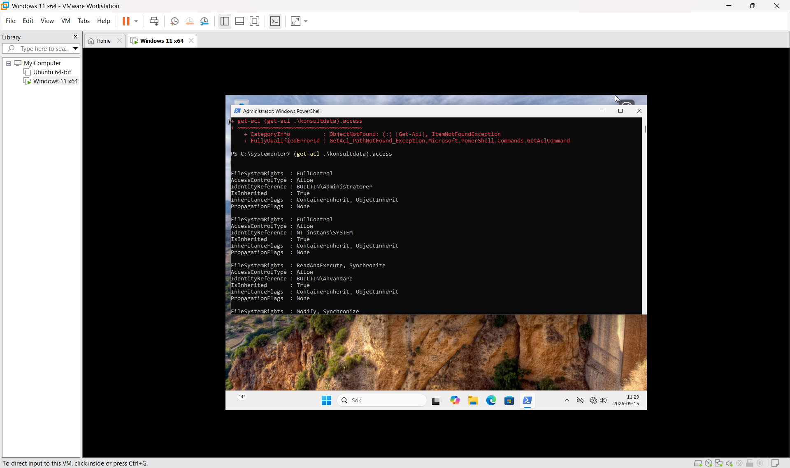
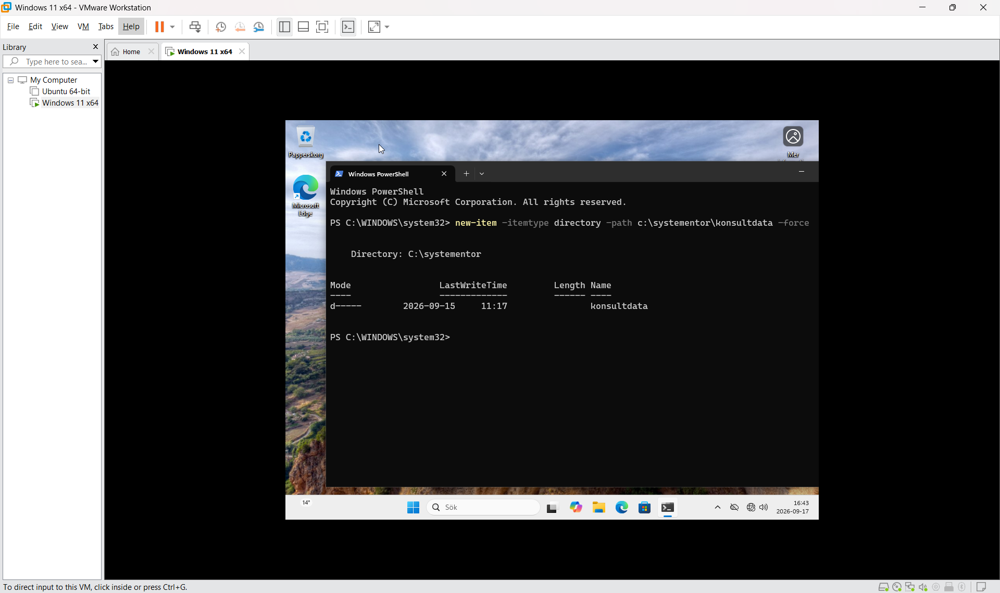
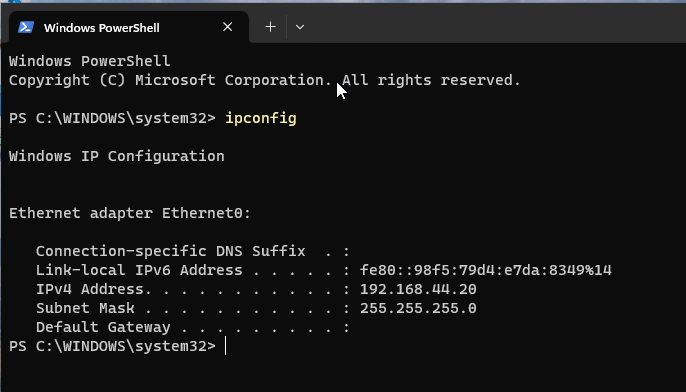
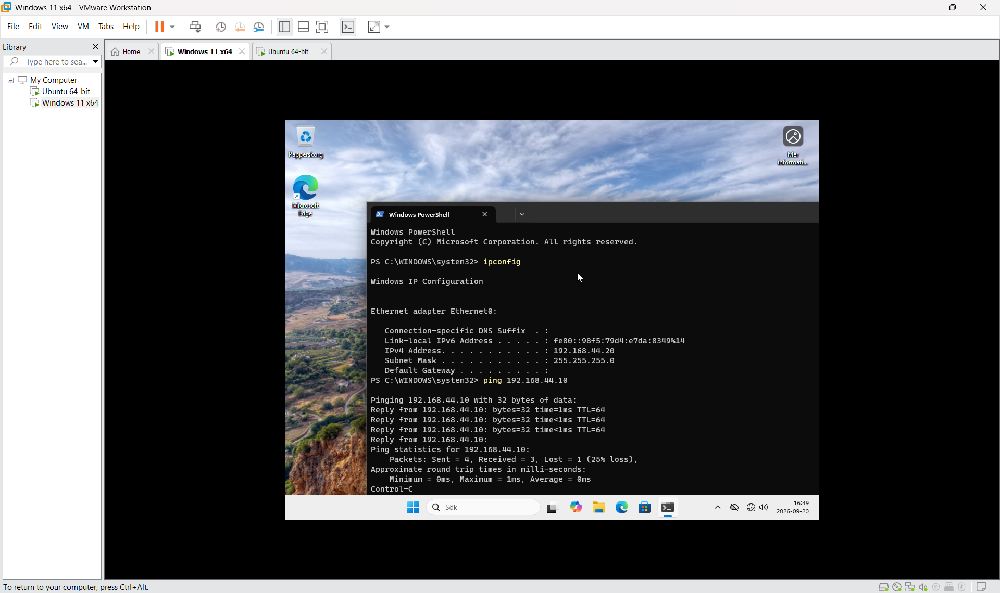

# Labbmiljö, Git, CLI och AI

Namn: Nathali Karlsson  
Datum: 2026-09-17  
Kurs: Introduktion till yrkesrollen och grunderna i IT-infrastruktur

Kort beskrivning av labbmiljön:
Labben består av en Linux-VM och en Windows-VM
som är placerade i samma interna nätverk och används för att genomföra
nätverks-, behörighets- och CLI-övningar.

## GIT/github


GitHub konto förklaras genom länken:
https://docs.github.com/en/account-and-profile/how-tos/account-management/creating-an-account-on-github 

alt. direktlänk till github och sätt upp konto där:
https://github.com/signup

Git laddas ner från den officiella sidan:
https://git-scm.com/book/en/v2/Getting-Started-Installing-Git

Skapa konto på github.
Installera git i windows 
installationen verifieras med git-version 
lägg det till mail och den måste vara samma som det konto som registreras på GitHub
fullständigt namn och efternamn
 Du får en key som klistras in på github under inställningar-ssh keys. Fungerar inte den, sök i dolda mappar på datorn efter .ssh och leta efter id_ed25519.pub-högerklicka-välj öppna med anteckningar, kopiera den nyckeln och klistra in i rutan där i ssh key.

i git terimnalen:
```
git --version
git config --global user.name "skriv ditt namn inom parentesen"
git --config global user.email "skriv din mail här"
ssh-keygen -t ed25519 -C "e-posten som är kopplat till github"
```

## skapa ett repository på GitHub
 
logga in på GitHub:
välj new för att skapa ett nytt repository
fyll i följande:
repository name: linuxwidowslab
description: lab_dokumentation
Visibility: public eller private
klicka på : add repository

på datorn lokalt: 
skapa en tom mapp som heter samma som på github linuxwindowslab
öppna vs code 
välj file- open folder och välj mappen på datorn
i vs code lägg till lab_dokumentation.md new file i foldern som du öppnat.
du gör samma om du vill ha en mapp med bilder väl new file döp den till images.

hur du kopplar din lokala mapp till Github för första gången: öppna terminalen i vs code:
```
git init
git status
git add 
git commit -m "här skriver du en komentar om dina tilläg eller ändringar"
git remote add origin
git push
```
Vid fortsatta ändringar skriv först ctrl+s för att spara lokalt på datorn. Sedan öppnar du terminalen i vs code och skriver:
```
git status 
git add 
git commit -m "spegla din arbetsprocess"
git push
```


## Labbmiljö & Nätverk

Här beskriver jag hur de två virtuella maskinerna sattes upp

installation av datorer i VMware på windows11 samt Ubuntu version26.04 på:
https://git-scm.com/install/windows
 

```
| Hostname       | Operativsystem  | IP-adress    | Subnätmask | Standard Gateway |
  natta00          ubuntu 26.04        192.168.40.10        /24          ingen gateway
  desktop-EA9HHF8  windows 11     192.168.40.20        /24          ingen gateway
```

### Nätverksuppsättning

Kort beskrivning av:
- vilken hypervisor som används
- vilket internt nätverk som används
- vilka statiska IP-adresser maskinerna har
- att maskinerna ligger i samma subnät 

1. hypervisor VMware jag använder PRO versionen
1. använder enligt genomförandemallen samma nät 40.10 samt 40.20.
1. static ip sattes på Ubuntu i inställningar-network-ipv4 sätt static ip.
1. static ip sattes i windows 11 genom inställningar-nätverk och internet ip-tilldelning-ändra från dhcp till manuell/static ange IP-adress och subnätmask 255.255.255.0(/24)

 ## Kommandoradsgenomförande
  Här ser man ip-adress, broadcast, ipv4 samt ipv6-adresser med subnätmask och gateway
 kontroll av ip-adress görs i powershell/Bash med följande kommando:
  
 ```
 ipconfig
 ```

 ```
 ip a
 ```


### Linux

#### Skapa mapp och fil
Skapar loggkatalog för mappen. -p flaggan skapar även överliggande mappar om de saknas. 
```bash
kommando sudo mkdir -p /var/systementor/konsultdata
sudo touch /var/systementor/konsultdata/anteckningar.txt
ls -l /var/systementor/konsultdata
```

#### Skapa grupp och rättigheter
Skapar grupp och regler för skriv/läsrättigheter. -m skapar hemkatalog och -g sätter användarens primära grupp. Till sist kontrollerar man rättigheter med ls -l. -la skriver ut hela mappen med alla filer uppradade för lättare översikt över rättigheter. katalogen är satt till 750 och och filen anteckningar.txt är satt till 640 enligt principen minsta behörighet.

```bash
sudo groupadd konsulter
sudo useradd -m -g konsulter konsultanv
sudo passwd konsultanv
sudo chown konsultanv:konsulter /var/systementor/konsultdata
sudo chown konsultanv:konsulter /var/systementor/konusltdata/anteckningar.txt
sudo chmod 750/var/systementor/konsultdata
sudo chmod 640 /var/systementor/konsultdata/anteckningar.txt
sudo ls -l /var/systementor/konsultdata
ls -l /var/systementor/konsultdata
sudo ls -la /var/systementor/konsultdata
```
jag kontrollerade nätverksinterfacet med ip a 

verifierar nätverksanslutningen genom att skriva ping 192.168.44.10 och få svar ttl


### Windows 

 I Windows defender-brandväggen med avancerad säkerhet går in på inkommande trafik 
 markerar raden; fil och skrivbegäran ICMPv4 in privat och välj i höger kollumn aktivera regel, för att brandväggen blockerar annars inkommande ping från Ubuntu.
 
 
 
 I windows använder jag powershell för att skriva in kommandon, och det behöver göras med administratör-rättigheter denna gången.
 set-location flyttar mig till mappen
 get-childitem skriver jag för att verifiera att mappen systementor listar konsultdata.
 Listar acl-regler med get-acl, resultatet visar vilka användare och grupper som har åtkomst samt vilka rättigheter de har. Flera av behörigheterna är ärvda från den överordnade mappen.
```Powershell
set-location c:\systementor
new-item -itemtype directory -path c:\systementor\konsultdata -force
get-childitem c:\systementor
(get-acl .\konsultdata).access
```
Admin och System har samma behörigheter medans Användare har mer begränsade rättigheter. 




verifierar nätverksinställningarna med ipconfig 


testade anslutningen med ping 192.168.44.20 och får svar ttl


 
## AI LOGG OCH KRITISK UTVÄRDERING

*ska tilläggas att jag pratar med chatgpt därav språket.*
### jag gav Chatgpt en prompt : 
 
 ### prompt 1:
 jag gjorde såhär först sudo group, add konsulter, och sen så sudo user add -m -g konsulter:konslutanv, vad står -m och -g för?
 svar från Chatgpt:
 -m skapar en hemkatalog för användaren och -g sätter användarens primära grupp, i ditt fall "konsulter" så komandot betyder: skapa användaren konslutanv, skapa dess hemkatalog och sätt primär grupp till konsulter.
 
 verifierades: genom att gå till mappen och se ordningen på strukturen

### Prompt 2 : 

 vad gör kolonet i konslutanv:konsluter?
 
 svar från chatgpt:
 kolonet i chown-kommandot skiljer på ägare och grupp, det som står före kolnet är ägaren. och det som står efter är grupp.
  
  verifierades: med att först försöka ändra på rättigheter-chmod, som rwx, vilket inte gick, så jag fick ändra från mig till konsulter och sedan kunde genom ls -l lista vilka rättigheter som var, och se ägare anv och andra, samt ändra för andra vilka rättigheter de fick för att verifiera att det verkligen var så genom att skriva o+r. och sedan ls -l

Genom att testa prompten kunde jag således verifiera att den fungerade.  Risker som finns är att det blir fel syntax, och att istället för att rm en fil så kan man lyckas att radera en hel folder eller mer. 
Innan jag skriver en prompt ställer jag därför en fråga, när man använder tex en flagga eller ett kommando, för att sedan ställa om frågan med mera av AI:s svar, och ställa en motfråga som "enligt dig skulle a+b=ö men detta säger att a+b=c. 
Man behöver vara kritisk på det sätt att inte lita blint på en AI. Hallucinationer kan komma genom att man ställer frågan väldigt öppen och inte riktad, eller att man ställer en allmän fråga och förväntar sig svar på en konkret del av svaret. Man kan även få en gammal syntax som inte riktigt gör vad man vill. 
klassisk hallucination:
-"är denna svampen giftig?"
- "nej den kan du äta" 
- "den är visst giftig"
- "ja förlåt mig du har helt rätt, den är giftig"
Genom att ställa frågan på flera olika sätt, och att kanske helt enkelt använda google för just flaggan man får som svar så kan man granska sin prompt och svaret man får av AI.
Genom att lära sig prompter kan man få fram mer träffsäkra svar.


